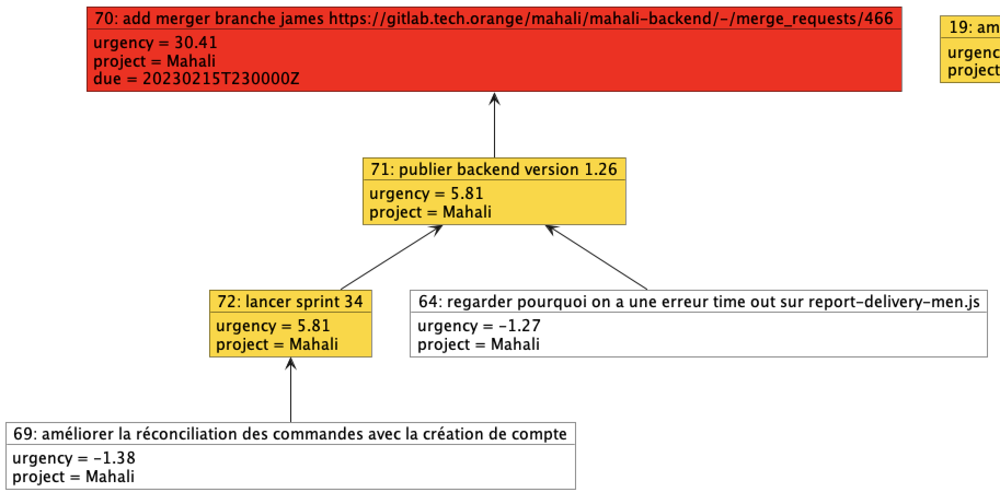

# TaskPlantDep - Taskwarrior PlantUML Dependency Graph

<!-- vim: set conceallevel=0 :-->

This tool is to convert you taskwarrior into a PlantUML graphic with dependencies.

## usage :

```bash
go run taskplant.go
```

This program will generate a file named `dependencies.puml` in the current directory.
Sample generated file: 

```plantuml
@startuml

object "72: lancer sprint 34" as 1d8ab3c7ad8c4192900e950140e7ae50
1d8ab3c7ad8c4192900e950140e7ae50 : urgency = 5.81
1d8ab3c7ad8c4192900e950140e7ae50 : project = Mahali
object "19: améliorer mon environnement vagrant" as 50fa3c14f22640fe9ac1f5bb652e8ec5
50fa3c14f22640fe9ac1f5bb652e8ec5 : urgency = 6.79
50fa3c14f22640fe9ac1f5bb652e8ec5 : project = Mahali
object "0: discuter avec Géraud Alexis story remplacement cloudinary" as 4cc5176acb5f424cb1df95f4cafca334
4cc5176acb5f424cb1df95f4cafca334 : urgency = 3.32
4cc5176acb5f424cb1df95f4cafca334 : project = Mahali
object "25: étudier remplacement par cloudinary" as 6c1117bcfe8247dfb4a545d11bda1dd7
6c1117bcfe8247dfb4a545d11bda1dd7 : urgency = 7.31
6c1117bcfe8247dfb4a545d11bda1dd7 : project = Mahali
object "0: ranger doc SRE" as 0b12c38a300d4e8ba209a497fdd117cc
0b12c38a300d4e8ba209a497fdd117cc : urgency = 19.05
0b12c38a300d4e8ba209a497fdd117cc : project = Mahali.SRE
0b12c38a300d4e8ba209a497fdd117cc : due = 20230209T230000Z
object "58: terminer vidéo prometheus" as 5acebdc127394f36850f4a53212c37b9
5acebdc127394f36850f4a53212c37b9 : urgency = 1.85
5acebdc127394f36850f4a53212c37b9 : project = Mahali.SRE
object "71: publier backend version 1.26" as 459174c9bab643908e130697a201bffb
459174c9bab643908e130697a201bffb : urgency = 5.81
459174c9bab643908e130697a201bffb : project = Mahali

50fa3c14f22640fe9ac1f5bb652e8ec5 <-- 49981d6188774eb7b0b8d8f4758200e5
4cc5176acb5f424cb1df95f4cafca334 <-- fc185169f9334e3cb189d439a5123898
6c1117bcfe8247dfb4a545d11bda1dd7 <-- fc185169f9334e3cb189d439a5123898
0b12c38a300d4e8ba209a497fdd117cc <-- 5acebdc127394f36850f4a53212c37b9
459174c9bab643908e130697a201bffb <-- 18d2b25bb99543c3968cbdb72aefb5ff

@enduml
```



You can send generate graph with any [plantuml tool](https://plantuml.com/fr/download).

Sample generated graph :


## Technology

This program is written in golang (v1.18).
This program has been tested with taskwarrior v2.6.2.
